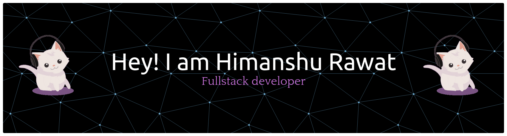

# Hey! I am Himanshu Rawat 🚀

  

 

  

---

### 💫 About Me

I am a passionate **Fullstack Developer** focused on building robust backends and clean, interactive user interfaces. I love breaking down complex problems, optimizing application performance, and continuously expanding my technical toolkit.

- 🛠️ Currently working on deep-diving into enterprise-grade system design.
- 🐧 Linux enthusiast who loves tweaking environments and working directly in the terminal.
- ⛰️ Part-time developer, full-time Orophile dedicated to exploring Himalayan history and culture.

---

### 🐍 My Contributions Snake

  

---

### 🛠️ Tech Stack & Tools

here is a curated selection of technologies I work with:

| Category | Technologies |
| :--- | :--- |
| **Frontend** |     |
| **Backend & Testing** |     |
| **Databases & Caching** |    |
| **DevOps & OS** |     |

---

### 📊 GitHub Analytics

  <table border="0">
    <tr>
      <td>
        
      </td>
      <td>
        
      </td>
    </tr>
  </table>
  
   
  
  

---

### 🤝 Connect With Me

Let's build something cool together or just talk about clean code and Linux custom setups!

  
  

 

  Built with 💪 and ☕. Updated dynamically.

